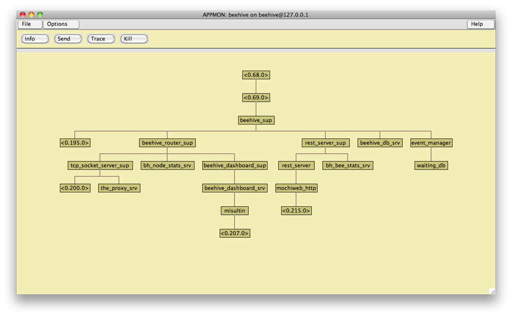

!SLIDE center execute what_head

# What? #

!SLIDE center bullets

 * Dynamic distributed router
 * Mnesia distributed database
 * Distributed event manager
 * RESTful HTTP-based server
 * Storage management system

!SLIDE center app_mon

