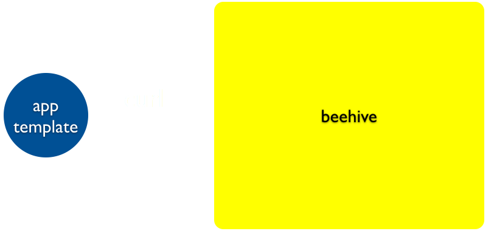
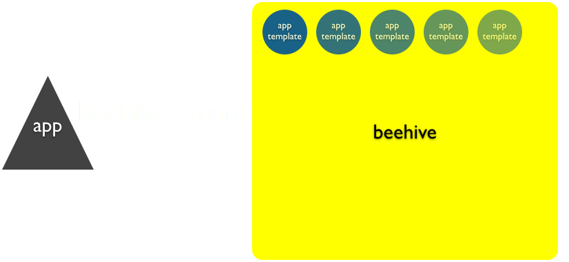
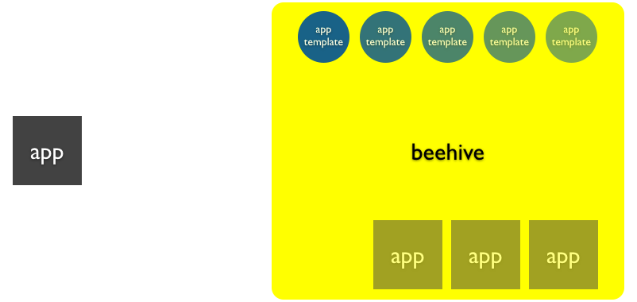

!SLIDE center
# How it works #

!SLIDE center
# Define an app #

!SLIDE code
<pre class="sunburst">$ curl -XPOST $HOST/apps</pre>
<pre class="sunburst">$ `beehive create`</pre>

!SLIDE center black

!SLIDE center black

!SLIDE center
# Deploy an app #

!SLIDE code
<pre class="sunburst">curl -i -XPOST
	-d &quot;{‘name’:‘beehive’, ‘token’:‘token’}&quot; 
	$HOST/apps/beehive/deploy</pre>

!SLIDE center black

!SLIDE center ready_to_go
# Ready to go! #

!SLIDE center deploy_time
# Deploy time #

## seconds ##

<pre><code>git push</code></pre>
