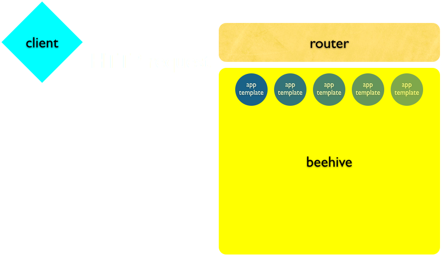
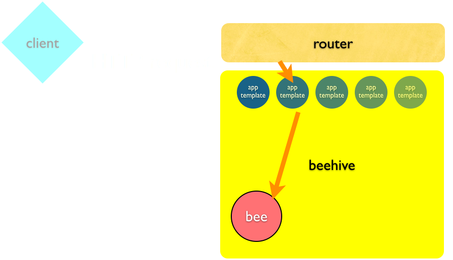
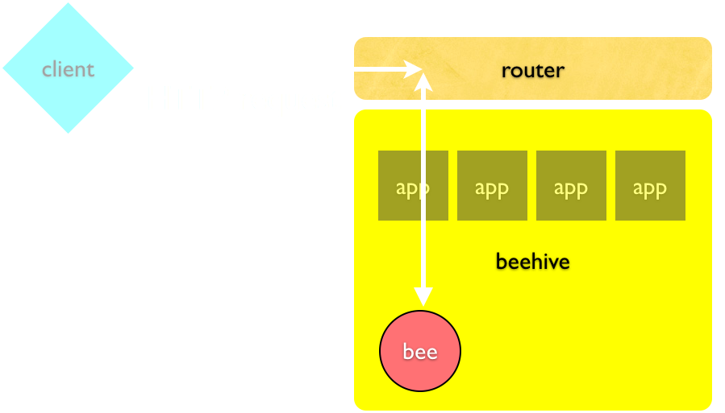

!SLIDE center
# HTTP request #

!SLIDE center black

!SLIDE center black

!SLIDE center black

!SLIDE center black

!SLIDE center black
# Note about the proxy #

<h2>
The active router acts as a proxy once connected
and boots with an <code>erlang</code> supervisor, so if anything 
happens to the server-side socket, it'll get restarted
automatically
</h2>