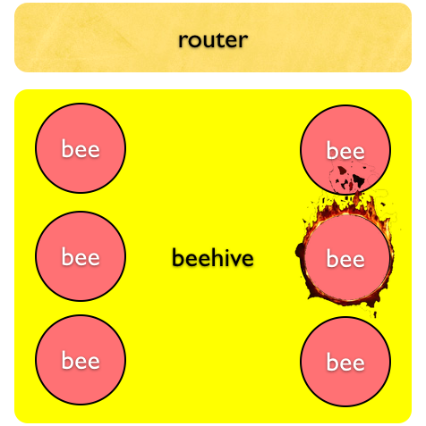
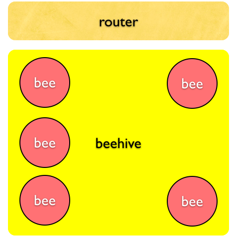

!SLIDE center
# Bee #

!SLIDE center
# Single-file containing everything beehive needs to deploy an application #

### including dependencies ###

!SLIDE center black bee

	<h1>Bee</h1>
	<ul>
		<li>Application</li>
		<li>Dependencies</li>
	</ul>

!SLIDE center black railgun
# Quickly deploy applications #

!SLIDE center cont_deployment
# Continuous deployment #

!SLIDE center black over_provision
# Overprovision, naturally reap resources

!SLIDE center black

!SLIDE center black 

!SLIDE center black
# Oh no, one of the servers caught on fire #

!SLIDE center black

!SLIDE center black

!SLIDE center black
# Let it die, start a new one only when necessary #

!SLIDE center black

